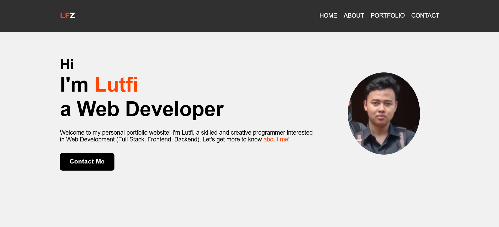
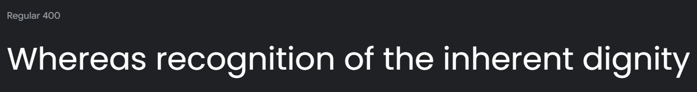
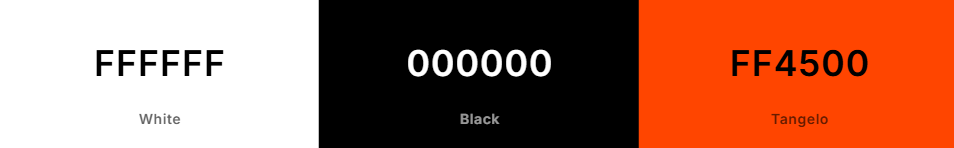
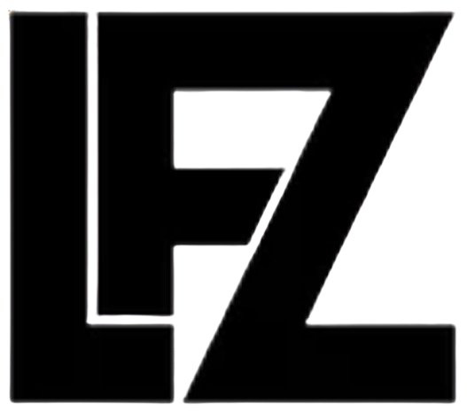

# [lutfifaizziyadatullah.free.nf](https://lutfifaizziyadatullah.free.nf/) - v1.0

This is the source code for my personal portfolio website.

    
    
    
    

  

## Table of Contents

- [Design](#design)
  - [Fonts](#fonts)
  - [Color Scheme](#color-scheme)
  - [Icon](#icon)
- [Built With](#built-with)
- [Creator](#creator)

---

## Design

### Fonts

[Poppins](https://fonts.google.com/specimen/Poppins) - sans serif

### Color Scheme

- White
- Black
- Orangered

### Icon

This is the icon of the website.

_Art credits to [Shutterstock](https://www.shutterstock.com/shutterstock/photos/2308358511/display_1500/stock-vector-lfz-initial-letter-monogram-logo-design-2308358511.jpg)._

---
## Built With

- 💙 [HTML5](https://www.w3schools.com/html/)
- 💜 [CSS3](https://www.w3schools.com/css/)
- 💙 [JavaScript](https://www.w3schools.com/js/DEFAULT.asp)
- 💜 [PHP](https://www.w3schools.com/php) for server-side scripting
- 💙 [MySQL](https://www.w3schools.com/mysql) and [phpMyAdmin](https://www.phpmyadmin.net/) for database management
- 💜 [Boxicons](https://boxicons.com/) for the icons
- 💙 [InfinityFree](https://www.infinityfree.net/) for free hosting

---

## Creator

Annie Wu ([anniedotexe](https://github.com/anniedotexe))

If you have any questions, comments, or concerns, feel free to contact me below.

  

This project was created for educational purposes and for personal use. 
- If you are interested in forking this to use as a template for your own portfolio website, please give credit (i.e., in the README) and ensure to update all information and content to be yours before deploying, so you are not displaying my content and information as your own. Thanks.

If you like my content or find this code useful, give it a ⭐ or support me by buying me a coffee ☕💙

---

## License

Copyright &copy; 2021-2024 Annie Wu. All rights reserved.
